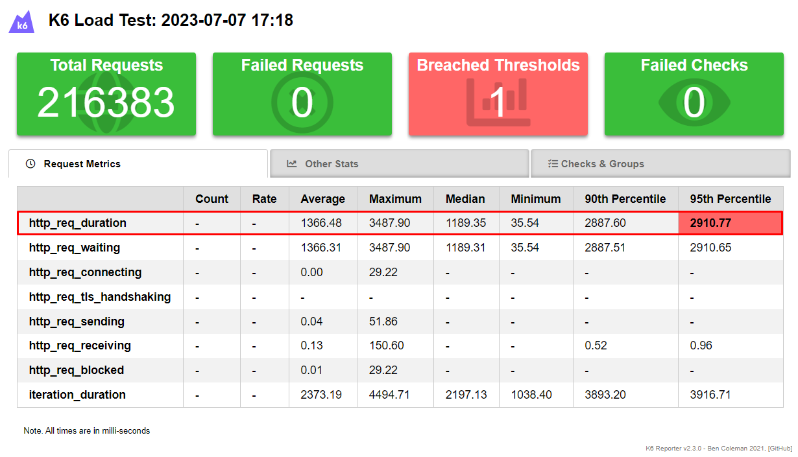

# O projeto ✨

Este projeto foi desenvolvido como parte do treinamento de introdução aos testes de performance com o K6, uma ferramenta de código aberto amplamente reconhecida e concorrente direta do JMeter. O treinamento foi ministrado pelo especialista Fernando Papito. Durante o treinamento, trabalhamos localmente, criando scripts e executando testes.

A API de cadastro de usuários já estava previamente implementada, com um banco de dados real, e contém requisitos funcionais e não funcionais. Nosso objetivo principal era validar os requisitos não funcionais, o que nos levou a realizar testes de performance com o K6.

Vale ressaltar que, embora a sintaxe para escrever os testes no K6 seja baseada em JavaScript, a ferramenta é executada em Go Lang e não em Node.js. Isso proporciona um ambiente de execução eficiente e robusto para os testes de performance.

## 👨🏻‍💻 Como executar o projeto

É necessário ter o [Node.js](https://nodejs.org/) v16 ou superior para executar.

Execute os comandos abaixo para instalar das dependências do projeto e colocar o servidor no ar:

```sh
cd curso-k6-basico/api
yarn install
yarn dev
```

## 🚀 Tecnologias

- [MongoDB] - Banco de dados (Não relacional)
- [k6] - ferramenta para teste de carga, performance, stress etc...

# Sobre a API

## 🔖 Requisitos funcionais (já testados previamente)

### Cadastro

- [X] Deve retornar os id ao cadastrar um novo usuário ()
- [X] Deve retornar 201 ao cadastrar um novo usuário
- [X] Deve retornar 400 ao tentar cadastrar sem email e senha
- [X] Deve retornar 400 se o email for duplicado

| campos   | descrição                             | tipo     | obrigatório |
| :-----   | :------------------------------------ | :------- | :---------- |
| email    | usuário identificador único           | email    | sim         |
| password | senha do usuário                      | texto    | sim         |

## 🔖 Requisitos não funcionais (aplicado no treinamento)

### Cadastro

- [ ] O cadastro com sucesso deve ocorrer em até 2 segundos
- [ ] Cadastros sem sucesso devem ocorrer em até 2 segundos
- [ ] Deve poder cadastrar até 100 usuários simultâneos
- [ ] A margem de erro no cadastro deve ser de pelo menos 1%

## Teste de fumaça (Smoke Testing)

O teste de fumaça tem como objetivo verificar se as principais funcionalidades do software estão funcionando corretamente. Esse tipo de teste é executado com uma carga mínima para não consumir muito tempo, pois seu foco principal é verificar se as coisas básicas estão em ordem.

Para realizar o teste de fumaça, foi criado o arquivo `signup-smoke.js`. Esse arquivo contém os testes específicos para verificar se o processo de cadastro de usuários está funcionando corretamente.

O smoke testing é uma abordagem útil quando se fazem modificações em um script existente, pois permite verificar se todas as funcionalidades ainda estão operacionais. Para mais detalhes sobre o smoke testing, você pode consultar o link [https://k6.io/docs/test-types/smoke-testing/](https://k6.io/docs/test-types/smoke-testing/).

Certifique-se de executar o teste de fumaça utilizando o arquivo `signup-smoke.js` para validar as funcionalidades básicas do software e garantir que tudo está funcionando conforme o esperado.

## Teste de carga (Load Testing)

O teste de carga foi realizado no arquivo `signup-load.js`. Esse teste tem como objetivo avaliar o desempenho do sistema sob uma carga típica e identificar os primeiros sinais de degradação durante períodos de aumento de carga ou carga total. Além disso, o teste visa garantir que o sistema continue atendendo aos padrões de desempenho após as alterações realizadas no sistema, tanto no código quanto na infraestrutura.

No arquivo `signup-load.js`, foram definidos três estágios para o teste de carga:

1. Primeiro estágio: duração de 1 minuto, com o objetivo de colocar 100 usuários simultâneos durante a execução do teste.

2. Segundo estágio: duração de 2 minutos, com 100 usuários realizando múltiplos cadastros simultâneos.

3. Estágio final: duração de 1 minuto, onde a carga de usuários é reduzida gradualmente, simulando a saída dos usuários do site e a realização de cadastros.

Além disso, foram definidos thresholds (limites) para monitorar o desempenho do teste. Os thresholds definidos são:

- `http_req_duration`: o tempo máximo permitido para a duração das requisições HTTP é de 2000ms (95%).
- `http_req_failed`: a taxa de falha das requisições HTTP deve ser menor que 0.01 (1%).

Esses thresholds servem como indicadores para avaliar o desempenho do sistema durante o teste de carga.

Você deve executar um teste de carga média para obter uma avaliação adequada do desempenho do sistema sob condições típicas de uso. Certifique-se de ajustar as configurações de carga de acordo com os requisitos e as capacidades do seu sistema.

Para mais detalhes sobre o teste de carga com o K6, você pode consultar a página [https://k6.io/docs/test-types/load-testing/](https://k6.io/docs/test-types/load-testing/).

## Teste de estresse (Stress Testing)

O teste de estresse foi realizado utilizando o arquivo `signup-stress.js`. Esse tipo de teste tem como objetivo levar o sistema aos limites extremos com base nos requisitos não funcionais da aplicação. O objetivo é verificar como o sistema se comporta sob condições de carga extrema e identificar possíveis pontos de falha ou degradação de desempenho.

No arquivo `signup-stress.js`, foram definidos vários estágios para aumentar gradualmente a carga no sistema:

- O primeiro estágio tem uma duração de 1 minuto e define um alvo de 100 usuários simultâneos.
- Em seguida, a carga é mantida em 100 usuários simultâneos durante 5 minutos.
- Os estágios subsequentes aumentam progressivamente a carga com durações e alvos diferentes, chegando a 400 usuários simultâneos durante 5 minutos.
- No estágio final, a carga é gradualmente reduzida até atingir 0 usuários simultâneos durante 10 minutos.

Além disso, foram definidos thresholds (limites) para monitorar o desempenho do teste de estresse. Os thresholds são:

- `http_req_duration`: a métrica estabelece que 95% das requisições devem ter uma duração menor que 2000ms (2 segundos). Isso significa que a maioria das requisições deve ser concluída em até 2 segundos.
- `http_req_failed`: a taxa de falha das requisições HTTP deve ser menor que 0.01 (1%). Isso significa que apenas 1% das requisições podem falhar.

No entanto, é importante observar que o teste de estresse não passou nos requisitos não funcionais, pois algumas requisições de cadastro ultrapassaram o limite de 2 segundos estabelecido. Isso indica que o sistema pode estar apresentando degradação de desempenho ou pontos de falha sob carga extrema.

Recomenda-se investigar as razões para as falhas de desempenho e otimizar o sistema, se necessário, para que ele atenda aos requisitos não funcionais estabelecidos.

Para mais detalhes sobre o teste de estresse com o K6, você pode consultar a página [https://k6.io/docs/test-types/stress-testing/](https://k6.io/docs/test-types/stress-testing/).

## Emitir um relatório de teste de performance com o K6

Para emitir um relatório de teste de desempenho com o K6 usando o plugin k6-reporter, siga as etapas abaixo:

1. No diretório `/tests`, adicione o seguinte código de importação nos arquivos de teste:

   ```javascript
   import { htmlReport } from "https://raw.githubusercontent.com/benc-uk/k6-reporter/main/dist/bundle.js";

   export function handleSummary(data) {
     return {
       "summary.html": htmlReport(data),
     };
   }
   ```

   Esse código importa a função `htmlReport` do plugin k6-reporter e define uma função `handleSummary` para gerar o relatório em formato HTML.

2. No diretório `/tests`, execute o seguinte comando no terminal para instalar o k6-reporter:

   ```
   $ npm install k6-reporter
   ```

   Isso instalará o k6-reporter em seu projeto.

3. Execute o teste de desempenho usando o comando `k6 run` seguido do nome do arquivo de teste que contém o código de importação adicionado.

   Por exemplo:

   ```
   $ k6 run signup-load.js
   ```

   Durante a execução do teste, o k6 irá gerar um arquivo chamado `summary.html`.

4. Após a conclusão do teste, abra o arquivo `summary.html` em um navegador da web. O relatório será exibido, mostrando informações e métricas sobre o desempenho do teste.

   O relatório mostrará as métricas coletadas durante o teste, incluindo a métrica `http_req_duration`. No teste, a métrica `http_req_duration` excedeu esse limite, resultando em uma falha nessa métrica específica.

   No relatório, é exibido gráficos, tabelas e outros dados relacionados ao desempenho do teste.


## Massa de teste dinâmica com UUIDs

Para utilizar UUIDs como parte da massa de teste dinâmica, siga as instruções abaixo:

1. No diretório `/tests`, execute o seguinte comando no terminal para instalar a biblioteca `uuid@3.4.0`:

   ```
   $ npm install uuid@3.4.0
   ```

   Isso instalará a versão 3.4.0 da biblioteca UUID em seu projeto.

2. Em seguida, instale o Browserify, que é um módulo que converte módulos Node.js em JavaScript. Ainda no diretório `/tests`, execute o seguinte comando no terminal:

   ```
   $ npm install browserify
   ```

   Isso instalará o Browserify em seu projeto.

3. Agora, execute o seguinte comando no diretório `/tests` para converter o módulo Node.js `uuid` em JavaScript e gerar o arquivo `uuid.js`:

   ```
   $ npx browserify node_modules/uuid/index.js -s uuid > uuid.js
   ```

   Esse comando utiliza o Browserify para criar o arquivo `uuid.js` a partir do módulo `uuid`. Esse arquivo será usado posteriormente para importar o UUID no teste.

4. Após a execução do comando acima, você pode excluir a pasta `node_modules` e o arquivo `package-lock.json`, se desejar, pois não serão mais necessários.

5. Dentro do diretório `/tests`, crie uma pasta chamada `libs` e mova o arquivo `uuid.js` para essa pasta. Isso ajudará a organizar a arquitetura dos testes.

6. Dentro do arquivo de teste `signup.js`, importe o UUID adicionando a extensão `.js` no caminho do arquivo, já que não estamos trabalhando com Node.js. Adicione a seguinte linha de importação no início do arquivo:

   ```javascript
   import uuid from './libs/uuid.js';
   ```

   Isso importará o UUID no escopo do teste.

7. Em seguida, na constante `payload` que contém os dados a serem enviados na requisição, você pode utilizar o UUID para gerar um identificador dinâmico para o e-mail. Utilize a função `uuid.v4()` para gerar o UUID e em seguida utilize a função `substring(24)` para obter os últimos caracteres do UUID gerado (ignorando os primeiros 24 caracteres).

   ```javascript
   const payload = JSON.stringify({
     email: `${uuid.v4().substring(24)}@qa.qacademy.com.br`,
     password: 'pwd123'
   });
   ```

   Dessa forma, o e-mail será único a cada execução do teste, adicionando uma variabilidade dinâmica à massa de teste.

Certifique-se de que as dependências foram instaladas corretamente e que os caminhos dos arquivos estão corretos para que as importações e as funcionalidades do UUID funcionem adequadamente em seu teste.

## Executando o arquivo test.sh (Bash)

Para executar o arquivo `test.sh`, siga as etapas abaixo:

1. Inicie o servidor digitando o seguinte comando no terminal:

   `$ yarn dev`

   Isso garantirá que o servidor esteja em execução e pronto para receber as requisições.

2. No terminal, conceda permissão de execução para o arquivo usando o seguinte comando:

   `$ chmod +x test.sh`

   Isso permitirá que o arquivo `test.sh` seja executado como um script.

3. Após conceder permissão de execução, execute o comando abaixo para realizar a chamada `curl`:

   `$ ./test.sh`

   Esse comando executará o script `test.sh`, que contém o comando `curl` com as configurações desejadas.

Certifique-se de estar no diretório correto onde o arquivo `test.sh` está localizado antes de executar os comandos acima.